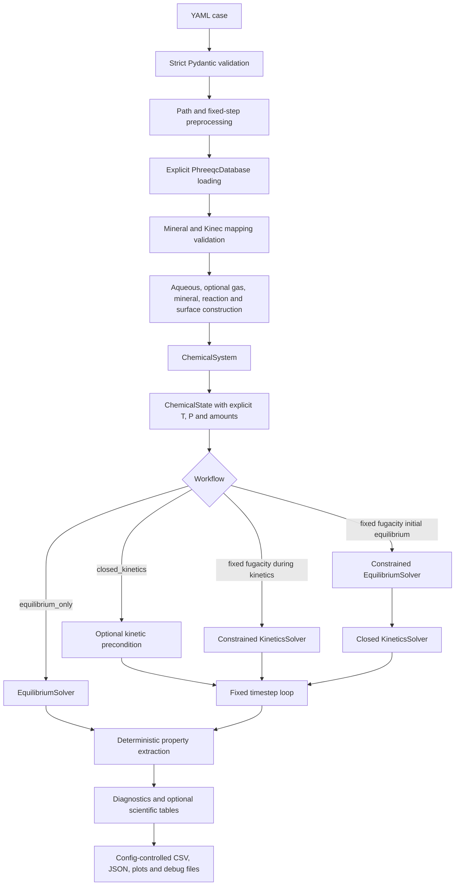

# Solver Scientific and Programmatic Analysis

## 1. Executive summary

The current repository is a clear and deliberately small V1 Reaktoro batch runner. Its implemented execution chain is easy to trace, `runner.py` remains orchestration-only, configuration models reject unknown fields, PHREEQC database selection is explicit, and the cleaned Kinec YAML is correctly separated from the thermodynamic database. The two supported fixed-fugacity workflows are represented directly in code and protected by focused tests. These are important strengths and should be retained.

The solver is nevertheless **not yet suitable for defensible kinetic dataset generation or long-horizon scientific use**. The main blockers are not the absence of every roadmap feature. They are weaknesses in the currently implemented path:

1. the Kinec callback converts Reaktoro automatic-differentiation quantities to Python `float`, so rate derivatives supplied to the nonlinear kinetics calculation are lost;
2. normalized mineral-surface inputs activate Reaktoro linear surface-area models, but this runtime behaviour is not explicit in the case schema and the output tables report the configured coefficient rather than the live area in m²;
3. fixed-step acceptance is based only on `result.succeeded()`, with no NaN, negative-amount, conservation, or timestep-refinement criterion;
4. saturation and change classifications use exact zero, causing numerical values around (10^{-12}) to be labelled as physically meaningful under- or supersaturation;
5. failure paths do not produce a complete diagnostic package and can leave a partial output directory that prevents a clean retry; and
6. the checked-in outputs are not a coherent current result set. In particular, the stored source-config hash for `calcite_quartz_illite_development` does not match the current case file, and the output contains fields that the active strict schema no longer accepts.

The existing output for the three-mineral development case also demonstrates a major performance concern: one one-second kinetic step required approximately 311.44 seconds and 74 iterations (`outputs/calcite_quartz_illite_development/solver_history.csv:3`). This observation is evidence of poor runtime behaviour, not proof of a single cause. The callback derivative loss, constrained chemistry, phase stiffness, and Reaktoro callback overhead all require controlled isolation before attribution.

The current readiness assessment is:

| Intended use | Rating | Summary |
|---|---|---|
| Exploratory batch calculations | **Conditionally ready** | Suitable for small, manually inspected equilibrium and short fixed-step kinetic software-development cases, provided existing outputs are not treated as current and kinetic conclusions are labelled provisional. |
| Defensible Objective 1 dataset generation | **Not ready** | Rate-interface validation, surface-area semantics, conservation, numerical convergence, output provenance, and benchmark validation are insufficient. |
| Kinetic long-horizon studies | **Not ready** | Only fixed timesteps are implemented; rejection, rollback, adaptive control, scheduled output, checkpointing, and long-horizon validation are design notes. |
| Objective 2 chemistry engine | **Not ready** | No demonstrated conservation under repeated calls, timestep convergence, rollout stability, failure recovery, or stable programmatic result contract exists. |

No recommendation below changes the scientific scope from batch geochemistry to transport or fracture modelling. Mineral precipitation, mineral-volume increase, or a batch regime label must not be interpreted as caprock or fracture sealing without an explicit transport, geometry, and property-update model.

## 2. Scope and review method

### 2.1 Evidence inspected

The review traced the complete implemented execution path through:

- `runner.py`;
- `batch_runner/config.py`;
- `batch_runner/simulation.py`;
- all modules under `batch_runner/simulator/`;
- `batch_runner/Kinect_Custom_Rates.py`;
- `batch_runner/outputs.py`, `manifest.py`, `output_tables.py`, `output_plots.py`, and `scientific_reports.py`;
- both test modules under `tests/`;
- all seven YAML files under `cases/`;
- the cleaned kinetic records in `data/kinetics/kinec_rates_minimal.yaml`;
- relevant phase and `RATES` records in `data/thermo/Kinec_v3_4.dat`;
- every text result and all three plots in the existing output packages; and
- the installed Reaktoro 2.13.0 C++ headers and Python binding exposed by the `fypr-reaktoro` environment.

The governing documents were read together:

- `AGENTS.md`;
- `docs/dev/output_package_design.md`;
- `docs/dev/solver_workflow_and_long_horizon_timestep.md`;
- `docs/dev/config_schema_feature_options.md`;
- the remaining developer guidance under `docs/dev/`; and
- the five applicable repository skills for direct Reaktoro syntax, PHREEQC database selection, Kinec YAML kinetics, case-config discipline, and user-editable design.

### 2.2 Checks performed

- The complete test suite was run in the documented environment: **25 tests passed** under Python 3.11.15, Reaktoro 2.13.0, Pydantic 2.13.4, and PyYAML 6.0.3.
- All runnable case files passed strict Pydantic schema validation.
- Static mineral mapping was checked without executing scientific simulations. All cases mapped successfully except `jayasekara_no_ion_exchange_software_test.yaml`, which produced the expected missing-Kinec-record failures for Chlorite(14A), K-feldspar, Goethite, Pyrite, and Ca-Montmorillonite. This case is therefore a mapping-failure demonstration, not a runnable kinetic case.
- The installed Reaktoro headers confirm that generic `ReactionRateModel` values are in mol/s (`ReactionRateModel.hpp:34-39`) and that `ChemicalProps.surfaceArea` is in m² (`ChemicalProps.hpp:328-331,494`).
- An in-memory Reaktoro construction probe showed that the generated generic Calcite reaction has stoichiometric coefficient (-1) for Calcite. Thus a positive generic reaction rate consumes Calcite in the currently selected interface.
- The installed mineral-specific interface documents the opposite semantic convention: negative for dissolution and positive for precipitation (`MineralReactionRateModel.hpp:59-61`). This does not prove the current generic path is wrong; it demonstrates why the selected interface and sign must be tested rather than inferred from the class name.
- The Calcite, Quartz, and Illite YAML parameters were compared with their source PHREEQC `RATES` blocks. The Arrhenius coefficients, activation energies, reaction orders, affinity exponents, and Calcite carbonate inhibition form are transcribed consistently (`Kinec_v3_4.dat:9282-9313`, `10328-10357`, and `11747-11776`). The database `RATES` blocks are not parsed at runtime.
- The protected pre-report filesystem baseline comprised 110 files with aggregate SHA-256 `90229C98280354D594497E95028094563CDFEC4BD67F06D6416196D86E73120B`, excluding this report path.

### 2.3 Evidence categories used

This report distinguishes:

- **verified implementation behaviour**: directly established from active code or an in-memory installed-API probe;
- **design requirement**: specified in `AGENTS.md` or the three coordinated design documents;
- **test-demonstrated behaviour**: protected by one of the 25 passing tests;
- **existing-output observation**: present in a checked-in output but not assumed to represent the current code or case;
- **scientific assumption**: a modelling choice such as batch closure or surface scaling; and
- **unverified risk**: plausible from the interface or control flow but requiring a focused numerical experiment before being stated as a defect.

### 2.4 Limitations

- The workspace has no `.git` metadata, so a commit identifier, branch status, and pre-existing tracked changes cannot be verified. File hashes are used instead.
- Long scientific cases were not rerun because the task prohibits changing existing outputs and the documented three-mineral one-second run takes several minutes.
- The review contains no independent experimental calibration or trusted external benchmark result.
- Existing output packages predate parts of the active code. They are evidence of historical runtime behaviour only where their provenance is explicitly stated.
- No claim is made that a solver-success flag proves thermodynamic, kinetic, or experimental correctness.

## 3. Current solver architecture and workflow

The public CLI is intentionally thin. It loads one case, passes a callback that writes the mineral-connection report, runs the simulation, writes the output package, and then applies the documented Windows/Reaktoro callback-finalization workaround (`runner.py:13-26`). Scientific construction and solver logic remain outside `runner.py`.

Configuration preprocessing currently derives only fixed step counts and a shortened final step (`batch_runner/config.py:537-663`). Adaptive, adaptive-long-horizon, checkpoint, restart, solver-safety, and smart-backend objects are absent from the active schema, as required by the current V1 status statements (`docs/dev/config_schema_feature_options.md:3-9`).

The four implemented workflows behave as follows:

- `equilibrium_only`: solve once, snapshot the solved state, and emit one row;
- `closed_kinetics`: optionally precondition, then call `KineticsSolver(system).solve(state, dt)`;
- `fixed_fugacity_initial_equilibrium_then_closed_kinetics`: condition time zero with fixed fugacity, then run unconstrained closed kinetic steps; and
- `fixed_fugacity_during_kinetic_steps`: construct a constrained kinetic solver and pass the same conditions object to each fixed step.

## 4. Compliance with repository design contracts

| Requirement | Evidence | Status | Consequence |
|---|---|---|---|
| Explicit PHREEQC database only; no fallback | Strict source literals and source-specific fields (`config.py:57-69`); direct `PhreeqcDatabase.fromFile/withName` (`simulator/database.py:10-21`) | **Compliant** | Database choice is traceable and a failed local path is reported explicitly. |
| Cleaned YAML is the runtime kinetic input | `KinecParams.local(case.kinetics_path)` (`simulation.py:35-37`); database `RATES` blocks are never read by runtime code | **Compliant** | Thermodynamic and kinetic inputs are correctly separated. |
| Missing thermodynamic mineral, kinetic record, or surface is a hard failure | Schema and mapping checks (`config.py:135-154`; `simulator/mapping.py:11-68`) | **Compliant** | No silent mineral skipping in the active path. |
| Use direct visible Reaktoro construction | `system_builder.py:16-52`, `state_builder.py:17-68`, and `solver.py:17-130` | **Compliant** | Scientific setup remains inspectable without an abstraction framework. |
| Use `ActivityModelPhreeqc` | `system_builder.py:20-21` | **Compliant** | PHREEQC aqueous activity behaviour is selected explicitly. |
| `runner.py` is orchestration only | `runner.py:13-26` | **Compliant** | No scientific logic has leaked into the CLI. |
| Unknown fields and invalid combinations fail validation | `StrictModel` forbids extras (`config.py:35-36`); cross-field validation (`config.py:436-534`); passing tests (`test_first_version.py:78-131`) | **Compliant** | Roadmap fields cannot be mistaken for active functionality. |
| Fixed-fugacity staging is explicit | Workflow predicates and tests (`workflows.py:11-45`; `test_fixed_fugacity_workflows.py:167-194`) | **Compliant** | Closed and constrained kinetic paths are intentionally distinguishable. |
| Fixed timesteps are the only active V1 mode | Strict fixed schema and runtime guard (`config.py:181-194`; `solver.py:23-26`) | **Compliant** | Adaptive and long-horizon features are not falsely exposed. |
| Deterministic CSV column order | Explicit column arrays and config-order extension (`output_tables.py:13-84`); focused test (`test_first_version.py:207-228`) | **Compliant** | Table shape is stable for downstream parsing. |
| Optional outputs are controlled from YAML | Conditional writing in `outputs.py:87-180` | **Mostly compliant** | Files are suppressed by output flags, although some postprocessing flags do not control extraction as their names imply. |
| No silent surface-area evolution | Normalized units invoke Reaktoro's linear surface model, but the active schema has no explicit surface-update choice (`system_builder.py:41-49`; installed `MineralSurface.hpp:34-43`) | **Not compliant in semantics** | Users cannot tell from resolved output whether area is constant or scales with mineral mass/volume. |
| Report failure stage and diagnostic context | Diagnostics are constructed only after successful completion (`simulation.py:44-87`); failures raise directly (`solver.py:133-135`) | **Not compliant** | Failed runs leave little machine-readable evidence and may leave a blocking partial directory. |
| Conservation evidence for scientific runs | Only optional configured-subset budgets exist (`scientific_reports.py:158-210`); no solver-level element/charge checks | **Not implemented in V1** | Solver success cannot establish mass, element, charge, or carbon conservation. |
| Rejected steps, rollback, checkpoints, restart, and long-horizon controller | Design explicitly says these remain notes (`solver_workflow_and_long_horizon_timestep.md:3-9`; `output_package_design.md:3-11`) | **Not applicable to current V1; roadmap only** | Their absence is a readiness limitation, not a defect against the declared active schema. |
| Output packages are current and traceable | Current writer adds schema metadata and hashes (`manifest.py:16-87`), but existing outputs contain mixed obsolete schemas and a mismatched source hash | **Implementation partial; checked-in evidence fails** | Existing results must be quarantined from scientific analysis until regenerated into a fresh versioned location. |

## 5. Scientific assessment

### 5.1 Thermodynamics and activity models

The thermodynamic path is scientifically disciplined at the software boundary. Database source selection is explicit, local paths must exist and end in `.dat`, embedded names are checked against Reaktoro, and there is no fallback (`config.py:57-69,585-602`; `simulator/database.py:10-21`). `ActivityModelPhreeqc(database)` is applied directly to the aqueous phase (`system_builder.py:20-21`). Finite CO₂ adds an explicit gas phase with `ActivityModelPengRobinsonPhreeqc`, whereas fixed fugacity is implemented as an equilibrium constraint and does not add a finite gas inventory (`system_builder.py:24-29`; `state_builder.py:54-68`). This distinction is correct and should remain visible.

The phase list is deliberately limited to configured minerals. That is appropriate for reproducibility, but it means secondary-mineral formation is possible only for explicitly included equilibrium or kinetic phases. A supersaturation index for an unconfigured phase is not equivalent to allowing that phase to precipitate. Dataset documentation must state the allowed mineral assemblage and should not describe the result as an unconstrained prediction of all secondary minerals.

### 5.2 Chemical state and constraint staging

Temperature, pressure, aqueous species, configured mineral amounts, and finite gas amount are set with explicit values and units (`state_builder.py:17-42`). Requested output species are checked against the constructed system before solving, preventing late misspelling failures.

The recommended fixed-fugacity workflow is implemented as an initial constrained equilibrium followed by closed kinetics (`solver.py:32-61`). The conditioned state is then the time-zero baseline. This is scientifically distinct from the pre-injection state and is correctly treated as a runtime baseline rather than a raw input copy.

Two unresolved workflow issues remain:

1. The staged development case requests `precondition_kinetics: true`, but the solver intentionally skips kinetic preconditioning for this workflow (`solver.py:58-76`). Existing diagnostics record requested `true` and applied `false`. This may be a valid decision because the initial equilibrium solve already conditioned the state, but the configuration currently requests behaviour that runtime code overrides.
2. In constrained kinetic mode, `EquilibriumConditions.setInitialComponentAmountsFromState(state)` is called once before the loop (`state_builder.py:60-68`), and the same conditions object is reused at all steps (`solver.py:56-85`). Whether Reaktoro expects those initial component amounts to be refreshed from each accepted state has not been demonstrated. A controlled two-step mass-balance test is required before the constrained workflow is used for scientific interpretation.

### 5.3 Kinec rate equations, units, sign, and interface

The runtime adapter follows the cleaned YAML and uses live Reaktoro temperature, species activities, saturation ratio, and surface area. For standard minerals it evaluates

\[
r = A_s\left(\sum_i A_i\exp\left[-\frac{E_i}{RT}\right]a_i^{n_i}\right)
\left(1-\Omega^{1/\sigma}\right),
\]

and for carbonate minerals it uses the source inhibition form

\[
\frac{A_c\exp[-E_c/(RT)]}{1+K_c(a_{\mathrm{HCO_3^-}}+a_{\mathrm{CO_3^{2-}}})}.
\]

The algebra matches the inspected PHREEQC blocks. The source coefficients are documented as mol·m⁻²·s⁻¹, Reaktoro supplies surface area in m², and the selected generic rate interface expects mol/s. The current dimensional chain is therefore plausible and internally consistent.

The current generic reaction equation contains Calcite with coefficient (-1), so a positive generic rate dissolves Calcite. The affinity factor is positive below saturation and negative above saturation, matching that equation. However, the installed mineral-specific interface documents negative dissolution and positive precipitation. The current adapter uses `ReactionRateModel(ChemicalProps)` rather than the mineral-specific `MineralReactionRateModelArgs` path (`Kinect_Custom_Rates.py:49-79`). The distinction must be locked by an executable sign/stoichiometry test; otherwise a future switch to the apparently more specific interface could silently reverse the reaction.

The most serious current numerical concern is the repeated conversion of Reaktoro `real` values to Python `float` for temperature, surface area, saturation ratio, and activities (`Kinect_Custom_Rates.py:93-115`). The callback then uses `math.exp`, also returning a scalar float. This strips automatic-differentiation information from the returned `ReactionRate`. Reaktoro may still converge, but it cannot receive the rate Jacobian implied by the chemical-property derivatives. The observed 311-second, 74-iteration one-second development step is consistent with a difficult or poorly differentiated nonlinear problem, but a profiling and derivative-preservation experiment is necessary before causation is claimed.

`KinecParams.local` also performs no scientific schema validation beyond YAML parsing (`Kinect_Custom_Rates.py:28-46`). Missing `family`, `sigma`, `terms`, `A`, `E`, `n`, or `Kc`, unsupported term names, non-positive sigma, and non-mapping YAML roots can therefore fail during construction or inside a live rate callback. The active YAML currently has 122 records and every `omega` value matches its record name, but this property is not enforced.

### 5.4 Surface-area treatment

The configured surface unit controls Reaktoro behaviour:

- a unit convertible to m² creates a constant area model;
- units convertible to m²/mol, m²/kg, or m²/m³ create a linear area model; and
- the six-argument overload creates a power model.

The active cases use `m2/g` and `cm2/cm3`, so they select linear mass- or volume-normalized surface models, not constant total surface area. For `m2/g`, this is consistent with the default PHREEQC expression (S = \mathrm{PARM}(2)mM), where current moles and molar mass determine current mineral mass. It is nevertheless a scientific surface-evolution law and must be explicit.

The current outputs do not reveal the live total surface. `evaluate_kinec_rate` obtains it, but `collect_row` discards `diagnostic["surface_area"]` (`extract.py:47-62`). `reaction_rates.csv` instead writes the configured coefficient and input unit (`scientific_reports.py:115-134`). A value such as `0.036 m2/g` is not the same physical quantity as a live reaction area in m². This distinction becomes material as minerals dissolve or precipitate.

### 5.5 Timestepping, convergence, and state continuity

Fixed-step preprocessing is deterministic and shortens the final step to land on the configured duration (`config.py:537-663`). Every kinetic step checks Reaktoro's success flag and records iterations and wall time (`solver.py:83-99,133-159`). These are useful software diagnostics.

Scientific acceptance is otherwise absent. The runner does not check:

- finite values;
- negative species or mineral amounts;
- changes in pH, saturation index, species, mineral amount, or rate;
- element, charge, water, or carbon balance;
- invariance under timestep refinement; or
- consistency between a single step and equivalent substeps.

The fixed-step V1 can remain simple, but a solver-success flag alone is insufficient evidence for a defensible kinetic trajectory. At minimum, fixed-step scientific cases need post-step safety and conservation checks plus a separate timestep-refinement study. Adaptive rejection and rollback belong later, as the design documents state.

On failure, time is incremented before success is checked (`solver.py:83-87`). Because the exception aborts the function, the advanced local time is not exported as accepted data. The more important issue is that the solver may already have mutated the state and the run produces no failure `SimulationResult`. Thus failure location, trial state, and conservation condition are lost.

### 5.6 Conservation and budgets

The optional carbon and element tables calculate totals only across user-configured species, minerals, and gases (`scientific_reports.py:158-210`). This is transparent and avoids invented stoichiometry, but these tables are **configured inventory subsets**, not complete Reaktoro component balances. They do not query all system species by element, do not verify mapping completeness against the database, and are not solver acceptance criteria.

The final state text reports charge and element amounts, but those values are not compared with the accepted baseline in machine-readable diagnostics. Long kinetic calculations require a Reaktoro-system-level element/component balance and a clear distinction between closed-system conservation and mass change imposed by fixed-fugacity constraints.

### 5.7 Saturation, mineral change, and regime interpretation

`_saturation_state` labels every negative SI as undersaturated and every positive SI as supersaturated; only exact zero is near equilibrium (`output_tables.py:177-182`). The checked-in three-mineral summary consequently labels Calcite at (8.56\times10^{-13}) as supersaturated, Quartz at (-2.82\times10^{-12}) as undersaturated, and Illite at (4.21\times10^{-10}) as supersaturated (`outputs/calcite_quartz_illite_development/mineral_summary.csv:2-4`). These classifications exceed the precision warranted by the result.

The rate-sign check and regime classification have the same exact-sign behaviour (`scientific_reports.py:138-153,241-271,476-489`). Tiny solver noise can therefore produce a failed sign check or an apparent dissolution/precipitation regime. The smallest correction is one explicit, source- or validation-supported tolerance used consistently across saturation state, rate-sign checks, mineral-change interpretation, and regime classification. This report does not invent that tolerance.

### 5.8 Scientific scope and interpretation boundaries

The model is batch equilibrium/kinetics. It does not represent spatial transport, fresh-brine renewal, caprock diffusion, multiphase flow, pressure evolution, fracture aperture, geomechanics, or leakage flux (`docs/dev/solver_workflow_and_long_horizon_timestep.md:73-88`). Therefore:

- batch dissolution is not a leakage-rate prediction;
- net precipitation is not proof of matrix self-sealing;
- matrix precipitation is not evidence of fracture sealing;
- mineral-volume change is not porosity change without a defined representative bulk volume and geometry;
- porosity change is not permeability or capillary-entry-pressure change without explicit update laws; and
- a long batch duration is not a long-distance or long-term reactive-transport prediction.

The current porosity/permeability output appropriately reports permeability and capillary-entry pressure as not evaluated when no law exists (`scientific_reports.py:425-455`). That restraint should be preserved.

## 6. Programmatic assessment

### 6.1 Control flow and maintainability

The execution flow is readable and appropriately modular. Modules have focused responsibilities, there is no backend factory or plugin manager, and direct Reaktoro calls remain visible. `runner.py` is only 30 lines and contains no scientific calculations. This is consistent with the user-editable design contract.

The code does expose a few semantic mismatches:

- `precondition_kinetics` may be requested but silently not applied for the staged workflow;
- `postprocessing.aqueous_molalities` and `postprocessing.saturation_indices` are validated fields but do not control extraction (`config.py:196-210`; `extract.py:20-45`);
- `activity_models` values are accepted but, because the schema permits only one active choice for each phase, builders select the hard-coded corresponding Reaktoro model rather than reading the field value; and
- `SimulationResult.initial_state` is retained but is not used by output writing after row extraction.

These do not justify a redesign. They require either explicit semantics or removal of misleading inactive flags when compatibility permits.

### 6.2 Validation and error handling

Pydantic `extra="forbid"` is correctly used at every model level. Database, CO₂, redox, kinetics, mineral role, workflow, output dependencies, and postprocessing mappings have clear validation errors (`config.py:35-534`). File paths are resolved from the project root and missing paths report the exact resolution (`config.py:571-602`).

Validation stops too early for Kinec scientific content. A record's internal parameter shape is not checked before the system and output directory are prepared. The mapping verifies record presence but not formula completeness or supported family. A malformed record can therefore fail in the callback after an expensive solver setup.

Runtime failures are raised as a generic `RuntimeError` containing the stage but no Reaktoro result status, iterations, state summary, or failed diagnostic package (`solver.py:133-135`). `simulation_completed` is always `True` because diagnostics are created only on success (`simulation.py:44-87`). The declared diagnostic fields for failure are therefore structurally present but operationally unreachable.

### 6.3 Partial outputs and retry behaviour

The mineral mapping callback creates the final output directory before mapping validity is enforced (`runner.py:18-20`; `simulation.py:37-40`; `outputs.py:66-74`). This intentionally preserves mapping evidence, but a mapping failure leaves a directory that causes the next `load_case` call to stop with `FileExistsError` (`config.py:585-588`). A solver failure after mapping has the same partial-package problem.

The smallest upgrade is not a general transaction framework. Use one clearly named temporary run directory or write a failure marker/diagnostics file, then rename only on successful completion. If preserving the failed directory is scientifically useful, give it an explicit failed-run identity and allow a new fresh run directory rather than making the configured path ambiguous.

### 6.4 Output integrity and provenance

The active writer has several good safeguards: it requires a fresh output directory, rejects legacy `results.csv`, hashes the source case and scientific input files, writes deterministic columns, and separates debug outputs from scientific tables (`config.py:585-588`; `outputs.py:77-180`; `manifest.py:19-98`).

The existing output tree nevertheless contains multiple generations:

- `outputs/source_supported_kinetic_case/results.csv` and its resolved config use a legacy schema in which duration and timestep lived under `kinetics`; the active code explicitly rejects this layout.
- `outputs/calcite_quartz_illite_development/debug/resolved_config.yaml:83-128,183` contains backend, safety, conservation, geochemical-control, restart, and checkpoint fields absent from the active V1 schema.
- The active manifest writer emits `output_schema_version` at the root and in `run_identity` (`manifest.py:55-64`), while the checked-in development manifest does not contain those fields.
- The development manifest stores source-config SHA-256 `538de8de...` (`outputs/calcite_quartz_illite_development/manifest.json:10`), whereas the current case file hashes to `44F98868...`.

These facts do not show that the numerical values were wrong when generated. They show that the output package is stale relative to the active case/code and must not be used as current scientific evidence. The repository has no Git commit metadata, so the manifest cannot currently tie an output to a unique code revision.

### 6.5 Determinism and output semantics

CSV columns are deterministic. Requested species and minerals preserve YAML order, and internally added budget names are sorted or projected back to configured mineral order (`output_tables.py:58-84`; `extract.py:70-85`). The output test directly checks the core ordering.

Some semantic labels need tightening:

- `rate_surface_normalized` lacks an explicit `mol_m2_s` unit in its name;
- `surface_area_value` may actually be a normalized coefficient such as m²/g, not a live area;
- SI classification lacks a tolerance recorded in the manifest; and
- result tables contain no row-level case hash, which is acceptable only if every table is kept with its matching manifest and package integrity is checked.

### 6.6 Performance

The direct code is not over-engineered, and Python orchestration overhead is negligible relative to the recorded Reaktoro solve. The material performance evidence is the one-second three-mineral step: 311.44 seconds and 74 iterations. Potential contributors requiring isolation are:

- rate callback loss of automatic derivatives;
- three simultaneous Python callbacks;
- equilibrium/kinetic stiffness near saturation;
- surface-normalized models and unit conversion;
- active phase/species breadth; and
- Reaktoro 2.13 constrained or callback behaviour on Windows.

No performance recommendation should precede a small profiling matrix. Optimising CSV writing, adding concurrency, or introducing an abstraction layer would not address the demonstrated bottleneck.

### 6.7 Test adequacy

The 25 passing tests protect important software boundaries: strict schema behaviour, path resolution, mapping failures, Reaktoro database/rate-model attachment, fixed step derivation, deterministic columns, zero-initial mineral summaries, output toggles, and fixed-fugacity staging.

They do not establish:

- numerical equivalence to the source PHREEQC rate implementation;
- rate sign through an actual undersaturated and supersaturated kinetic step;
- preservation of rate derivatives;
- runtime surface area in m² for each accepted unit basis;
- mass, element, charge, or carbon conservation;
- failure diagnostic completeness;
- timestep convergence;
- scientific benchmark accuracy; or
- multi-step constrained-condition correctness.

The current test suite is therefore a sound V1 software suite, not a scientific validation suite.

## 7. Prioritised findings

| ID | Severity | Category | Evidence | Weakness or uncertainty | Possible consequence | Smallest suitable upgrade | Validation required |
|---|---|---|---|---|---|---|---|
| SR-01 | **Critical** | Data integrity; reproducibility | `manifest.py:55-87`; existing development manifest line 10; computed current case hash | Existing outputs mix obsolete schemas and the development manifest's case hash does not match the current case. | Historical values may be attributed to current code/configuration and contaminate PhD datasets. | Quarantine existing packages as historical; regenerate only into fresh versioned directories after blockers are resolved. | Verify every package hash, schema version, code identity, and expected file set before aggregation. |
| SR-02 | **High** | Numerical reliability; performance; scientific validity | `Kinect_Custom_Rates.py:93-115`; installed generic rate interface `ReactionRateModel.hpp:34-39` | Live autodiff quantities are converted to float inside the callback. | Missing rate derivatives may slow or destabilise nonlinear solves and obscure sensitivity to chemistry. | Preserve Reaktoro-compatible differentiable values in the runtime callback; keep float conversion only in post-solve diagnostics. | Compare callback values and derivatives against an independent formula and measure iterations/wall time on the same case. |
| SR-03 | **High** | Scientific validity; testing/documentation | `Kinect_Custom_Rates.py:49-79`; installed `MineralReactionRateModel.hpp:59-61`; generated Calcite coefficient (-1) | Generic and mineral-specific interfaces have different sign semantics, but no executable sign/unit contract protects the selected path. | A future interface correction could reverse dissolution and precipitation without an obvious error. | Add one focused test that checks reaction stoichiometry, total-rate units, and mineral change below and above saturation. | Trusted one-mineral benchmark for both dissolution and precipitation directions. |
| SR-04 | **High** | Scientific validity; configuration; diagnostics | `system_builder.py:41-49`; installed `MineralSurface.hpp:34-43`; `extract.py:47-62`; `scientific_reports.py:115-134` | Normalized units activate linear surface evolution, while outputs report the coefficient rather than live area. | Reaction progress can be misinterpreted and rates cannot be audited dimensionally over time. | Make surface model/basis explicit and export live area in m² separately from its configured coefficient and unit. | Analytical surface calculation at initial and altered mineral amounts for every accepted unit basis. |
| SR-05 | **High** | Numerical reliability; scientific validity | `state_builder.py:60-68`; `solver.py:56-85` | Constrained kinetic conditions capture component amounts once and are reused; required lifecycle is unverified. | Multi-step fixed-fugacity/redox trajectories may impose stale component constraints. | Verify the Reaktoro 2.13 contract and refresh conditions per accepted state if required. | Two-step constrained run compared with explicit per-step condition reconstruction and element accounting. |
| SR-06 | **High** | Numerical reliability; scientific validity | `solver.py:83-99,133-159` | Reaktoro success is the only step-acceptance criterion. | A converged step can still contain non-finite values, negative amounts, excessive change, or timestep error. | Add fixed-step post-solve safety checks and require a separate timestep-refinement validation for scientific cases. | Deliberate NaN/negative tests plus full-step versus substep convergence benchmark. |
| SR-07 | **High** | Scientific validity; reproducibility | `scientific_reports.py:158-210`; `simulation.py:49-87` | No complete solver-level element/component, charge, water, or carbon balance is calculated. | Silent mass-balance error can enter training data or long trajectories. | Compute balances from the constructed Reaktoro system and classify open-boundary contributions explicitly. | Closed-system invariance and fixed-fugacity open-system accounting tests. |
| SR-08 | **High** | Scientific validity; diagnostics | `output_tables.py:151-182`; `scientific_reports.py:138-153,241-271` | Exact zero is used for SI, rate-sign, and mineral-change classification. | Numerical noise becomes a false geochemical regime or sign failure. | Use one explicit validated tolerance consistently and record it in the manifest. | Near-zero synthetic rows plus a reference equilibrium case; tolerance selected from solver/benchmark evidence. |
| SR-09 | **High** | Data integrity; diagnostics; maintainability | `simulation.py:44-87`; `solver.py:83-87,133-135`; `outputs.py:66-83` | Failures do not return a diagnostic result, and partial output directories block retries. | Failure provenance is lost and users may manually mix partial and complete files. | Write machine-readable failed-run diagnostics and give partial runs an unambiguous status/path. | Fake-solver failure at initial equilibrium, precondition, and kinetic step; assert no package is marked complete. |
| SR-10 | **High** | Configuration; scientific validity | `Kinect_Custom_Rates.py:28-46,82-119`; `simulator/mapping.py:11-68` | Kinec record presence is checked, but record structure, supported terms, and parameter domains are not. | Malformed scientific input can fail late or be partially ignored. | Validate the cleaned YAML deterministically before system construction without adding defaults. | Missing/unknown field, invalid family, non-positive sigma, and nonnumeric parameter cases. |
| SR-11 | **High** | Testing/documentation; reproducibility | `tests/test_first_version.py:142-163`; `test_fixed_fugacity_workflows.py:167-194` | Tests establish attachment and control flow, not scientific equivalence, conservation, or timestep convergence. | Passing tests may be mistaken for solver validation. | Add a minimal scientific benchmark layer separate from software unit tests. | Reference outputs with documented provenance, units, and acceptance tolerances. |
| SR-12 | **Medium** | Configuration; diagnostics | `solver.py:58-76`; development case `solver.workflow` block | Staged workflow requests preconditioning but runtime skips it. | Manifest intent and executed behaviour differ, complicating reproducibility. | Either reject this combination or define the flag as not applicable for the staged workflow and record that explicitly. | Workflow spy test covering requested/applied state and one numerical comparison. |
| SR-13 | **Medium** | Configuration; maintainability | `config.py:196-210`; `extract.py:20-45` | `aqueous_molalities` and `saturation_indices` do not control extraction. | Users cannot rely on the schema to describe runtime work or output availability. | Connect the flags to behaviour or remove them from the active schema at a compatibility boundary. | Config-toggle tests for extraction and dependent summaries. |
| SR-14 | **Medium** | Reproducibility; configuration | `config.py:633-650` | A timestep expressed in years can silently use 365.25 days when the duration unit is not years. | Equivalent-looking cases can use an undocumented year definition. | Require `year_definition_days` whenever any configured time value uses years. | Mixed-unit duration/timestep validation cases. |
| SR-15 | **Medium** | Data integrity; diagnostics | `scientific_reports.py:115-134`; `extract.py:47-62` | Surface-normalized rate and area columns do not encode distinct units/semantics precisely. | Downstream analysis can multiply or compare incompatible quantities. | Rename columns to explicit units and export coefficient, coefficient basis, and live m² in separate fields. | Dimensional audit against the callback's total mol/s rate. |
| SR-16 | **Medium** | Configuration; documentation | `cases/jayasekara_no_ion_exchange_software_test.yaml`; runtime mapping check | The case passes schema validation but cannot attach five requested kinetic minerals with the cleaned YAML. | It may be mistaken for a runnable scientific case and leave a partial output directory. | Label it explicitly as an expected-failure mapping audit or remove it from runnable-case documentation. | Automated case catalogue reporting schema-valid, mapping-valid, and runnable status separately. |

## 8. Recommended scientific upgrades

### 8.1 Immediately necessary before kinetic scientific use

1. **Establish the Kinec rate contract.** Verify the chosen Reaktoro callback type, differentiability, mol/s dimensional chain, and dissolution/precipitation sign. Compare Calcite, Quartz, and Illite callback rates with an independent transcription of the inspected source equations at controlled states. Do not alter source parameters during this verification.
2. **Make surface behaviour explicit.** Distinguish total constant area, mass-normalized linear area, volume-normalized linear area, and any future power law. Record the live total area at accepted states. Preserve the current normalized source values but stop calling them an unqualified surface area.
3. **Add complete conservation evidence.** For closed kinetics, check Reaktoro component/element totals and charge relative to time zero. For fixed-fugacity steps, separately report the externally imposed component exchange rather than labelling the system closed.
4. **Define numerical scientific acceptance.** Add finite/negative checks and perform timestep refinement. Tolerances must come from solver precision, a trusted benchmark, experimental uncertainty, or explicit user decision—not from this review.
5. **Introduce a consistent numerical-noise band.** Apply it to SI state, rate-sign checks, mineral change, and regime classification. Store the value and provenance in the manifest.
6. **Verify constrained-condition state continuity.** Demonstrate that repeated constrained steps use the intended component baseline and boundary interpretation.

### 8.2 Required before Objective 1 dataset generation

- Regenerate all training cases only after the Phase 0 issues above are resolved.
- Store input, code, database, and kinetic-YAML identities with every package.
- Record the permitted mineral assemblage, surface model, workflow, timestep, and validation status as dataset-domain fields.
- Reject or quarantine cases that fail conservation, numerical convergence, or scientific benchmark criteria.
- Keep equilibrium, kinetic, finite-CO₂, and fixed-fugacity cases in distinguishable domains.
- Treat regime classification as a batch geochemical tendency, not as transport, permeability, capillary-entry-pressure, or fracture-sealing evidence.

### 8.3 Optional extensions after validation

- Adaptive and long-horizon stepping with rollback, rejected-step logging, scheduled output, and checkpoints.
- Source-supported surface evolution beyond the Reaktoro linear models currently selected by normalized units.
- Explicit experimental validation cases with uncertainty and provenance.
- Secondary-phase sensitivity studies using declared alternative phase assemblages.
- Porosity inference only with a defensible bulk volume; permeability and capillary-entry-pressure inference only after explicit, calibrated update laws.

Smart solvers, generic backends, plugin systems, whole-model abstractions, and large test harnesses are not scientific priorities and should not be introduced unless a measured need appears.

## 9. Recommended programmatic upgrades

1. **Validate Kinec YAML once, early.** Extend the small existing loader or mapping validation with explicit supported record fields and numeric-domain checks. Do not build a registry or parser framework.
2. **Keep the current module boundaries.** Solver orchestration belongs in `simulator/solver.py`; state/condition construction in `state_builder.py`; outputs in the existing focused modules. No architecture rewrite is warranted.
3. **Make failed runs first-class.** Catch failures at the simulation boundary, capture stage and solver information, and write a minimal failure manifest/diagnostics package without marking the run complete.
4. **Prevent ambiguous partial directories.** Use a simple temporary directory or explicit failed-run suffix and a final rename. This is a filesystem integrity measure, not a workflow engine.
5. **Align config intent with execution.** Resolve the staged precondition flag, connect postprocessing flags to behaviour, and require an explicit year definition whenever years appear.
6. **Strengthen provenance.** Add a code identity when Git is available; otherwise hash the small active Python source set. Record the output schema version consistently and provide a package-integrity check.
7. **Separate input coefficients from runtime quantities.** Output normalized surface coefficients with their bases and live areas in m². Encode rate units in column names.
8. **Profile before optimising.** Compare derivative-preserving versus scalar callbacks and one versus several kinetic minerals. Do not optimise plotting or add concurrency before the Reaktoro solve is isolated.

## 10. Validation and testing strategy

| Check | What it protects | Required inputs | Acceptance criterion | Trusted reference needed? |
|---|---|---|---|---|
| Kinec formula parity | Correct transcription of source kinetics | Cleaned YAML and selected PHREEQC `RATES` blocks | Independent calculation and callback agree within a justified numerical tolerance for each supported term family | **Yes**, source equation and unit interpretation |
| Generic-interface sign test | Dissolution/precipitation direction | One configured mineral in controlled under- and supersaturated states | Mineral decreases below saturation and increases above saturation, consistent with reaction stoichiometry and reported rate sign | **Yes**, interface contract; not an experimental rate |
| Callback derivative test | Nonlinear solver Jacobian quality | Reaktoro differentiable property values | Returned rate carries derivatives consistent with finite-difference or autodiff reference derivatives | **Yes**, installed Reaktoro interface |
| Surface model audit | Correct total reaction area | Known mineral amount/mass/volume with each accepted area unit | Reaktoro live area equals the analytically expected area; output distinguishes coefficient from live m² | No external experiment; dimensional reference is sufficient |
| Fixed-step refinement | Numerical convergence | One small source-supported kinetic case | Final pH, mineral amounts, selected species, and SI converge under successive step subdivision using predeclared criteria | A high-resolution numerical reference is required |
| Closed-system conservation | Mass/component integrity | Closed finite-CO₂ or gas-disabled case | Element/component totals and charge remain within justified solver tolerances | Reaktoro initial totals provide the reference |
| Fixed-fugacity accounting | Open-boundary transparency | Staged and constrained fixed-fugacity cases | Any component change is partitioned into internal redistribution and imposed boundary exchange | A defined boundary-accounting formulation is required |
| Constrained condition lifecycle | Correct multi-step constraints | Two or more fixed constrained steps | Reused and explicitly refreshed conditions produce the documented intended behaviour; differences are explained | Installed API contract and controlled numerical reference |
| Solver failure package | Data-integrity behaviour | Fake failed equilibrium, precondition, and kinetic results | Run is marked failed, stage/reason are present, no complete manifest is emitted, and accepted state is not misreported | No |
| Noise-band classification | Robust SI/regime labels | Synthetic values around zero and one equilibrium benchmark | Values inside the validated band are consistently near-equilibrium/unchanged across all reports | Tolerance provenance required |
| Output provenance check | Dataset contamination prevention | Current case, code, database, kinetic YAML, and expected file list | All hashes and schema identities match before a package is admitted | No external scientific reference |
| Case catalogue check | Clear case status | Every YAML case | Each case is labelled schema-valid, mapping-valid, runnable, expected-failure, or template | No |

These checks should remain small and focused. Scientific benchmark data should be stored separately from software-only fixtures so synthetic values cannot be mistaken for experimental calibration.

## 11. Phased upgrade roadmap

### Phase 0 — Blockers to trustworthy scientific use

- Quarantine stale/mixed output packages from analysis and dataset assembly.
- Validate the Kinec callback interface, derivatives, units, stoichiometry, and sign.
- Make surface-area model and runtime total area explicit.
- Add fixed-step finite-value, non-negativity, conservation, and timestep-refinement evidence.
- Apply a validated numerical-noise tolerance consistently.
- Verify constrained-condition lifecycle across multiple steps.

**Completion criterion:** a small Calcite–Quartz–Illite case passes formula, sign, surface, conservation, and timestep checks with a self-consistent current manifest and no unresolved High scientific finding.

### Phase 1 — Correctness and diagnostic improvements

- Validate complete Kinec YAML record structure before construction.
- Produce machine-readable diagnostics for every failure stage.
- Prevent ambiguous partial output directories.
- Align preconditioning and postprocessing flags with actual runtime behaviour.
- Strengthen package/code provenance and rate/surface column units.

**Completion criterion:** every success and forced failure produces an unambiguous, schema-valid package state, and every active config flag has one observable runtime effect.

### Phase 2 — Robustness and long-horizon validation

- Implement adaptive and adaptive-long-horizon schemas only when their runtime controller is ready.
- Add accepted-state snapshots, rejected-step rollback, rejection logging, scheduled output times, and checkpoints.
- Keep restart separate and disabled until reconstruction is tested.
- Validate long-horizon results against fixed-step refinement windows and conservation budgets.

**Completion criterion:** rejected trials cannot change accepted state, scheduled times are hit exactly, checkpoint contents are sufficient for audit, and long-horizon results agree with validated shorter-window references.

### Phase 3 — Optional enhancements

- Add experimental validation ledgers with real sources and uncertainties.
- Evaluate source-supported surface-area evolution alternatives.
- Add explicit porosity/property-update laws only after calibration.
- Prepare a stable repeated-call chemistry interface for Objective 2, including conservation, domain checks, and fallback-to-physics requirements for any future surrogate.

**Completion criterion:** each enhancement has one explicit config owner, execution location, output effect, focused validation, and documented disable path.

## 12. Strengths and retained design choices

The following decisions are sound and should be preserved:

- explicit `PhreeqcDatabase` loading with no fallback;
- strict separation of thermodynamic `.dat` input and runtime kinetic YAML;
- direct `AqueousPhase`, optional `GaseousPhase`, `MineralPhases`, `ChemicalSystem`, `ChemicalState`, and solver calls;
- `ActivityModelPhreeqc` for the aqueous phase;
- hard failure for missing thermodynamic minerals, Kinec records, and kinetic surfaces;
- explicit mineral aliases rather than heuristic name matching;
- strict Pydantic unknown-field rejection;
- solver duration/timestep ownership outside `kinetics`;
- explicit distinction between staged closed kinetics and constrained kinetics;
- a small orchestration-only `runner.py`;
- deterministic output columns and zero-initial-value handling;
- config-controlled optional outputs;
- separation of debug validation tables from scientific result tables;
- hashes for the case, database, and kinetic YAML in the manifest;
- explicit caveats that batch results are not transport or fracture-sealing predictions; and
- refusal to infer permeability or capillary-entry-pressure change without an update law.

These strengths mean the repository needs targeted scientific hardening, not an architectural rewrite.

## 13. Open questions and evidence gaps

1. Which exact Reaktoro Python callback type should be the durable project contract: generic `ReactionRateModel(ChemicalProps)` or mineral-specific `MineralReactionRateModelArgs`? The sign convention must follow the selected type.
2. What is the supported differentiable math path for Python callbacks in Reaktoro 2.13, and does the current kinetics solver use those derivatives in its Jacobian?
3. Are all Kinec `A` coefficients definitively in mol·m⁻²·s⁻¹ for every family, and is their provenance documented outside the database comments?
4. For each case, is a surface input a total area, specific area per current mass, area per mineral volume, or an initial value intended for a power law?
5. Is the staged workflow intentionally considered preconditioned by its initial equilibrium step? If so, why does its case request kinetic preconditioning?
6. Does Reaktoro require `setInitialComponentAmountsFromState` to be refreshed before every constrained kinetic step?
7. What solver- and benchmark-supported tolerances should define near equilibrium, unchanged mineral amount, conservation error, and timestep convergence?
8. Which experimental or independently calculated cases will serve as trusted Objective 1 validation targets?
9. Which secondary phases are deliberately permitted in each mineral assemblage, and which are excluded for experimental or numerical reasons?
10. What repository/version identifier should be used when `.git` metadata is unavailable?
11. Should `jayasekara_no_ion_exchange_software_test.yaml` remain as an expected-failure mapping audit, or should runnable cases be kept in a separate directory?
12. What repeated-call state and conservation contract will Objective 2 require before this batch solver is embedded in transport?

## 14. Final readiness assessment

### 14.1 Exploratory batch calculations — Conditionally ready

The equilibrium construction, database loading, strict configuration, and workflow staging are sufficiently clear for exploratory software-development calculations. Short kinetic runs may also be used to investigate solver behaviour, provided results are manually audited and explicitly labelled unvalidated. The checked-in outputs must not be assumed current, and kinetic rates must remain provisional until SR-02 to SR-05 are resolved.

### 14.2 Defensible Objective 1 dataset generation — Not ready

Objective 1 datasets require consistent rate semantics, surface-area behaviour, conservation, timestep convergence, stable output provenance, and benchmark validation. The current system does not yet supply that evidence. Generating many successful runs would scale uncertainty rather than resolve it.

### 14.3 Kinetic long-horizon studies — Not ready

The active runner supports only fixed timesteps. Adaptive acceptance, rollback, rejected steps, scheduled long-horizon output, checkpointing, restart, and validated large-step growth are explicitly roadmap items. Moreover, the observed runtime for a one-second three-mineral step is currently prohibitive. Long-horizon scientific claims would be unsupported.

### 14.4 Objective 2 reactive-transport chemistry engine — Not ready

Embedding chemistry in transport requires reliable repeated state transitions, conservation, bounded failure behaviour, timestep sensitivity control, and a stable machine-readable interface. None has yet been validated across repeated external calls. Batch geochemistry should not be conflated with transport-limited caprock alteration, and a future surrogate must remain subordinate to validated physics with explicit fallback conditions.

### Modification and integrity statement

This review is analysis-only. No source code, YAML configuration, scientific input, test, notebook, existing documentation file, or existing output was intentionally changed. The only created project file is:

`docs/reviews/solver_scientific_and_programmatic_analysis.md`

Because the workspace has no Git metadata, integrity was assessed using a pre/post SHA-256 aggregate over all protected files. The protected baseline contained 110 files and had aggregate SHA-256 `90229C98280354D594497E95028094563CDFEC4BD67F06D6416196D86E73120B`. A matching post-write value demonstrates that this Markdown report was the sole file-level modification.
